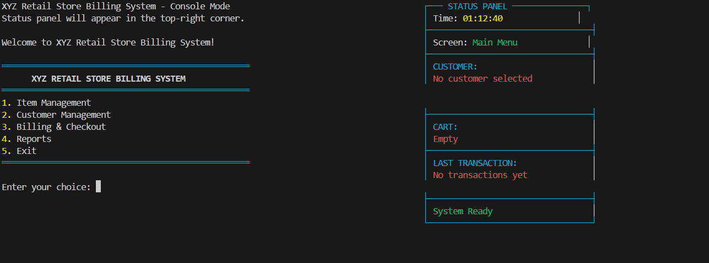
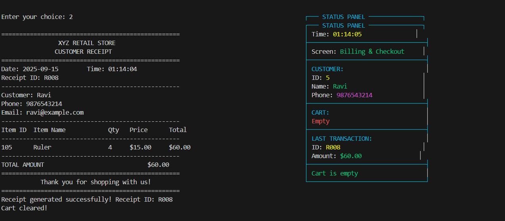
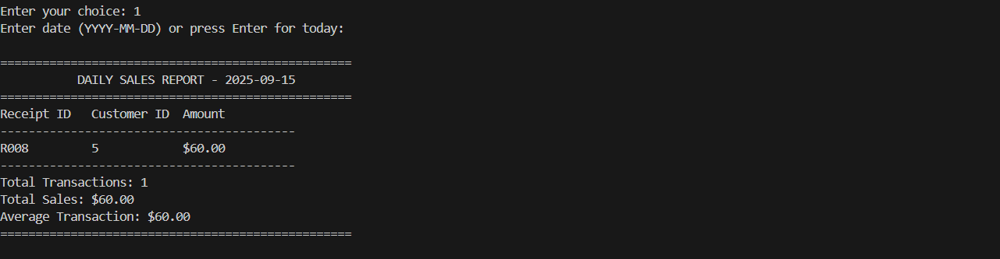

# 🛒 XYZ Retail Store Billing System (Console-Based)

A **console-based Retail Store Billing Application** built in **C programming** using **Data Structures (DS)** and **File Handling**.  
The application is designed to handle **item billing, customer management, and store reporting/analytics** in a modular way.

---

## 📌 Project Overview
This project is divided into **three major modules**, each focusing on specific responsibilities:

### 🔹 Module 1: Item Billing and Receipt Generator
- Search items from the item database  
- Add items to customer’s cart / Delete items at checkout  
- Generate receipt with customer details, item list, and total amount  
- Store receipt logs with timestamp  

**Data Structures Used:** Linked List / Array (for cart)  
**Files Used:** `items.dat` / `items.txt`, `receipts.dat` / `receipts.txt`  

---

### 🔹 Module 2: Customer Management
- Register a new customer (Name, Phone, Email, Address)  
- Update customer profile  
- Search customer by name or mobile number  
- Fetch receipt history  

**Data Structures Used:** Structure (for customer profiles), Indexing (for search)  
**Files Used:** `customers.dat`, `customer_index.txt`  

---

### 🔹 Module 3: Store Reporting and Analytics
- Generate Sales Reports: Daily / Weekly / Monthly  
- Product-wise sales report  
- Customer-wise total spending report  
- Show overall income over any period  

**Data Structures Used:** Hash Table / Linked List (for aggregation)  
**Files Used:** `receipts.dat`, `report.txt`  

---

## 📂 Project Structure
```
XYZ-Billing-System
│── main.c           # Entry point with menu
│── item.c / item.h  # Item billing & receipt generator
│── customer.c/h     # Customer management
│── report.c/h       # Store reporting & analytics
│── Makefile         # Project build automation
│── data/            # All database files are stored here
│     ├── items.dat
│     ├── customers.dat
│     ├── receipts.dat
│     ├── report.txt
│
└── README.md        # Documentation
```

---

## 📝 Sample File Formats

**items.dat / items.txt**  
```
ItemID, ItemName, Price, Stock
101, Pen, 10, 100
102, Notebook, 50, 200
```

**customers.dat / customers.txt**  
```
CustID, Name, Phone, Email, Address
1, Rahul, 9876543210, rahul@example.com, Patan
```

**receipts.dat / receipts.txt**  
```
ReceiptID, CustID, Date, TotalAmount
1, 1, 2025-08-04, 250
```

---

## 🚀 How to Run the Application

### Step 1: Clone the Repository
```
git clone https://github.com/your-username/XYZ-Billing-System.git
cd XYZ-Billing-System
```

### Step 2: Build Using Makefile
```
mingw32-make
```

### Step 3: Run the Application
```
mingw32-make run
```

## 📊 Expected Output (Features)

- Clear and user-friendly **console menu navigation**  
- **Receipt generation** with customer + item details  
- **Sales / analytics reports** displayed on console or saved in `report.txt`  
- Support for **multiple customers simulation**  

---

## 🎯 Learning Outcomes
- Strengthening **modular programming** skills in C  
- Real-life implementation of **Data Structures** (Linked List, Array, Hashing)  
- Handling **file-based databases** efficiently  
- Generating automated **reports & analytics**  
- Writing **clean & organized code** with Makefile support  

---

## 🖼️ Project Screenshots
(Add your screenshots here)

<p align="center">
  
</p>

<p align="center">
  
</p>

<p align="center">
  
</p>

---

## 👨‍💻 Author
**XYZ Billing System** was developed as part of learning:  
- C Programming  
- Data Structures (Linked List, Hashing, Arrays)  
- File Handling in C  

📌 Contributions are welcome via Pull Requests!  

---
